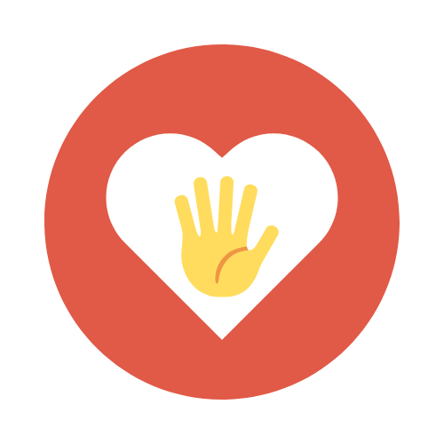
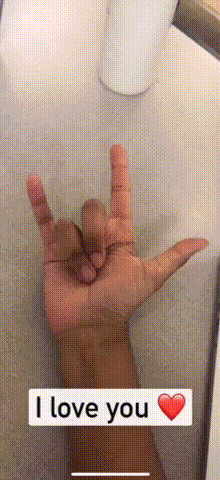

# Sign Language to Text using Custom Vision (ASLove)

This project aims to assist individuals with speech impairment by transcribing actions in ALS to text in real time using the camera on an IOS device.

For this project we used Microsoft Custom Vision to train our machine learning model, and python to collect our dataset.

We aim to utilize the computing power in current generation devices to be able to make life simpler for those with different abilities.

## Working

# Team Members:

* Jade

* Kha

* Kartik
